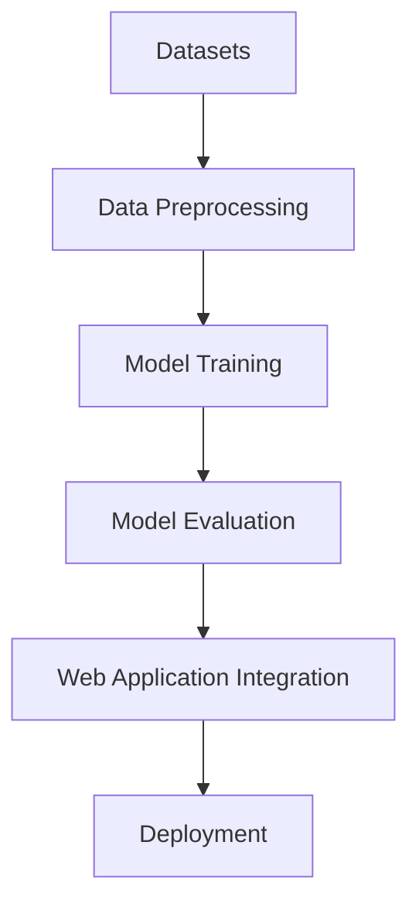

# Prediction of Disease Outbreaks 🌐🤖

Welcome to the **Prediction of Disease Outbreaks** project repository! This repository is part of the AICTE Internship on AI: Transformative Learning with TechSaksham, a joint CSR initiative by Microsoft & SAP. The project leverages Machine Learning to predict potential disease outbreaks using health-related datasets. 🚀

---

## 📜 Project Overview
The **Prediction of Disease Outbreaks** project aims to:
- **Identify disease patterns** based on health-related datasets.
- **Predict potential outbreaks** for diabetes, heart diseases, and Parkinson's disease.
- Provide a **user-friendly web interface** for easy access to predictions.

This project will benefit healthcare professionals and researchers by helping them make informed decisions based on data-driven predictions.

---

## 📌 Features
- 🔍 **Data Analysis**: Comprehensive analysis of health datasets.
- 📈 **Machine Learning Models**:
  - **Diabetes Prediction**
  - **Heart Disease Prediction**
  - **Parkinson's Disease Prediction**
- 🌐 **Web Application**: User-friendly interface for predicting diseases based on user inputs.

---

## 📊 Datasets Used
We used the following datasets:
- **Diabetes Dataset** (`diabetes.csv`)
- **Heart Disease Dataset** (`heart.csv`)
- **Parkinson's Dataset** (`parkinsons.csv`)

Each dataset has been preprocessed and analyzed to ensure accurate predictions.

---

## 🧠 Machine Learning Models
Three different models were trained using the datasets:
1. **Diabetes Prediction**
   - Training Notebook: `diabetes.ipynb`
   - Model File: `diabetes_model.sav`

2. **Heart Disease Prediction**
   - Training Notebook: `heart.ipynb`
   - Model File: `heart_model.sav`

3. **Parkinson's Disease Prediction**
   - Training Notebook: `parkinsons.ipynb`
   - Model File: `parkinsons_model.sav`

---

## 🛠️ Project Workflow


---

## 🌟 Requirements
To run this project, ensure you have the following installed:

- Python 3.8+
- Required Libraries:
  ```bash
  pip install -r requirements.txt
  ```

---

## 🚀 Getting Started
Follow these steps to set up and run the project:
1. **Clone the repository**:
   ```bash
   git clone https://github.com/Srishanth3108/Prediction-of-Disease-Outbreaks.git
   ```

2. **Navigate to the project directory**:
   ```bash
   cd Prediction-of-Disease-Outbreaks
   ```

3. **Install dependencies**:
   ```bash
   pip install -r requirements.txt
   ```

4. **Run the web application**:
   ```bash
   python app.py
   ```

5. Access the application at `http://localhost:5000` 🌐

---

## 🖼️ Screenshots

### 1. Home Page


### 2. Predictions


---

## 📚 Folder Structure
```
Prediction-of-Disease-Outbreaks/
│
├── datasets/
│   ├── diabetes.csv
│   ├── heart.csv
│   └── parkinsons.csv
│
├── training_models/
│   ├── diabetes.ipynb
│   ├── heart.ipynb
│   ├── parkinsons.ipynb
│   ├── diabetes_model.sav
│   ├── heart_model.sav
│   └── parkinsons_model.sav
│
├── app.py
├── requirements.txt
└── README.md
```

---

## 📜 Certification Criteria
To successfully complete the internship:
- ✅ Attend master sessions with Microsoft, SAP, and EF experts.
- ✅ Participate in mentorship sessions.
- ✅ Complete weekly tasks/milestones.
- ✅ Submit the final project presentation.

---

## 🤝 Acknowledgments
We thank **Microsoft, SAP, and AICTE** for this incredible learning opportunity and the **Edunet Foundation** for their continuous support. 🙌

---

## 📝 License
This project is licensed under the MIT License. See `LICENSE` for details.

---

Enjoy building! 💻✨
